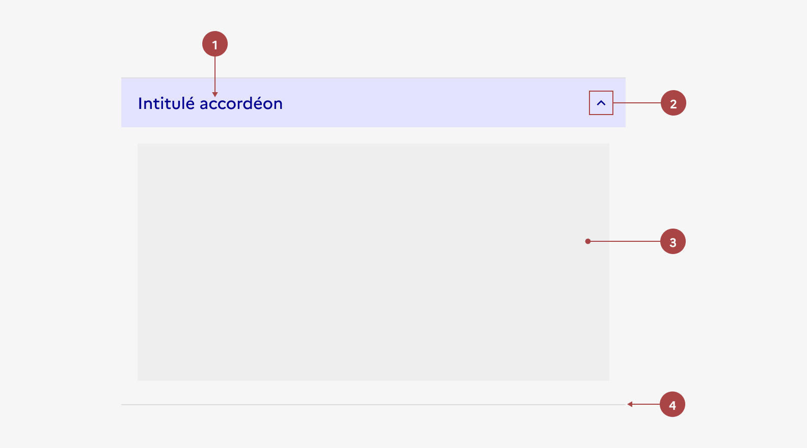
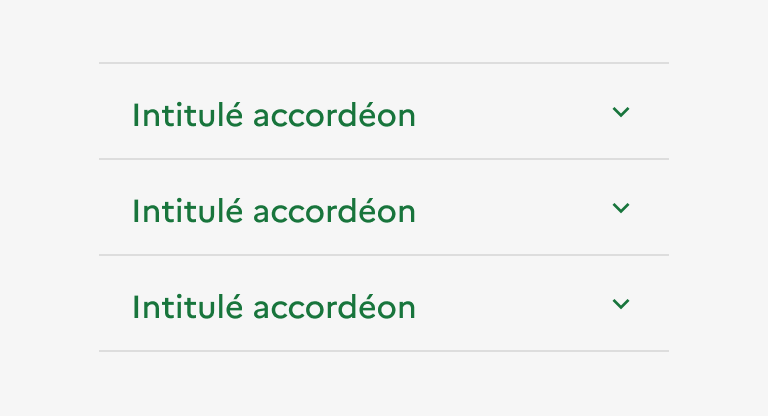
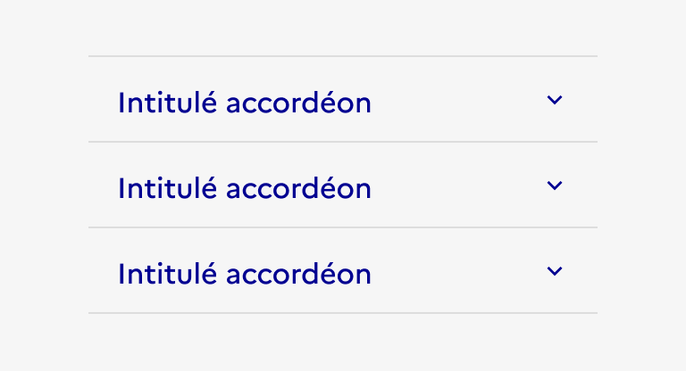
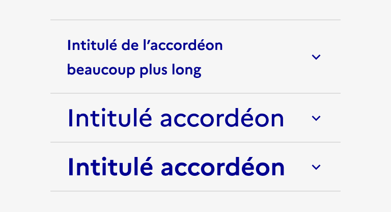

# Design de l'Accordéon

Présentation des choix graphiques, des principes visuels et des variantes disponibles du composant Accordéon.

## Anatomie

L'accordéon est composé de :

1. **Un en-tête** (obligatoire) - correspondant au titre de la section
2. **Un chevron orienté vers le bas** (obligatoire) - indiquant que le panneau peut s'ouvrir. Il est orienté vers le haut quand le panneau peut se refermer
3. **Une zone de contenu libre** (obligatoire) - masquée par défaut
4. **Un séparateur** (obligatoire)

## Variations

### Groupe d'accordéons

- Par défaut, les accordéons compris dans un groupe d'accordéons sont fermés. Seuls l'en-tête et le chevron sont visibles.
- La totalité de la barre d'en-tête est cliquable. Au clic, le contenu est révélé, ou caché, et le chevron change d'orientation en conséquence.
- Par défaut, le groupe d'accordéons ne permet l'ouverture que d'un accordéon à la fois. Le clic sur un accordéon du groupe entraîne la fermeture de l'accordéon précédemment ouvert.

> **Note**
> L'utilisation d'accordéons non liés entre eux (seuls et non au sein d'un groupe) reste toutefois possible, permettant l'ouverture de chaque accordéon indépendamment des autres.

### Tailles

La largeur de l'accordéon s'adapte à la taille de son conteneur. Toutefois, il est recommandé de ne pas excéder une largeur de 8 colonnes, s'agissant d'un composant de mise en forme de contenu.

### États

**État au clic**

L'état au clic correspond au comportement constaté par l'usager une fois le panneau ouvert, après avoir cliqué sur l'accordéon.

**État au survol**

L'état au survol correspond au comportement constaté par l'utilisateur lorsqu'il survol le bouton d'ouverture de l'accordéon avec sa souris. Il existe 2 états au survol :

- Lorsque l'accordéon est non cliqué
- Lorsque l'accordéon est cliqué

## Personnalisation

Les accordéons ne sont pas personnalisables.

**✅ À faire**

Utiliser uniquement la couleur bleu pour les accordéons.

**❌ À ne pas faire**

Ne pas personnaliser la couleur des accordéons.

---

**✅ À faire**

Utiliser uniquement la taille de typographie prévue pour l'en-tête des accordéons.

**❌ À ne pas faire**

Ne pas augmenter la taille de typographie de l'en-tête des accordéons.
